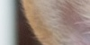
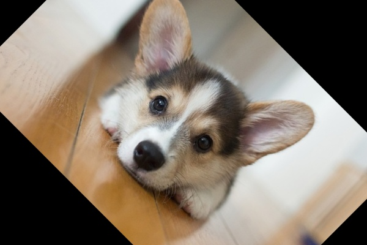
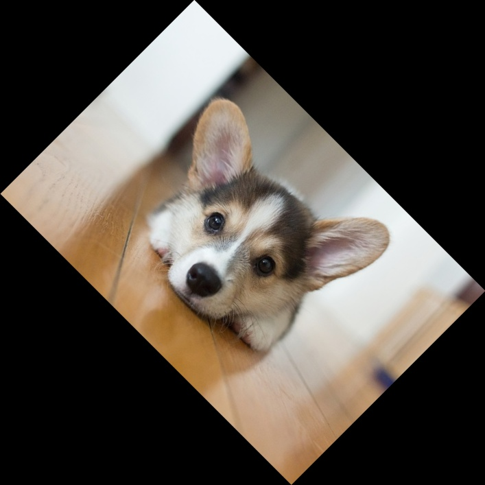
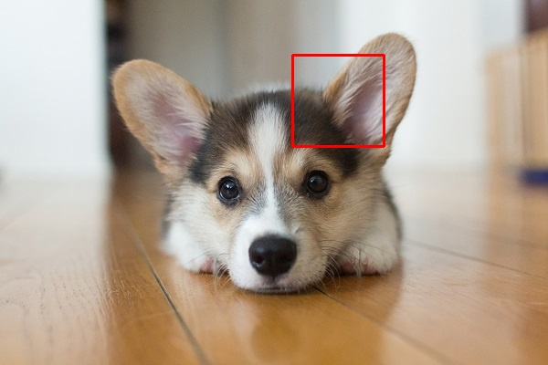
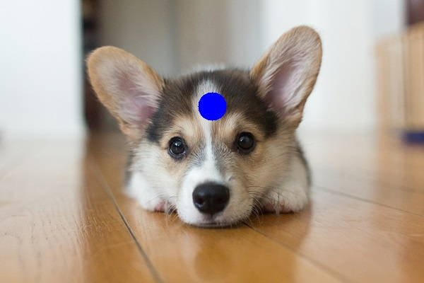
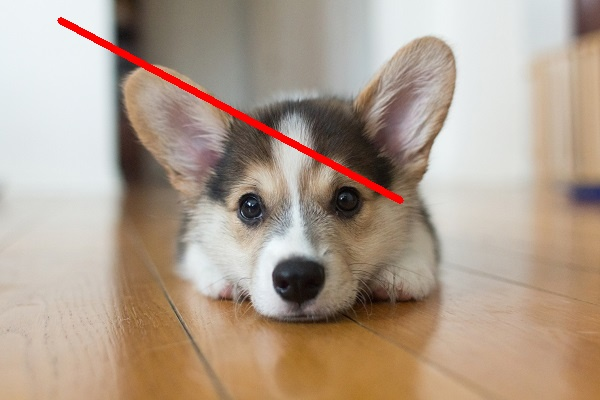
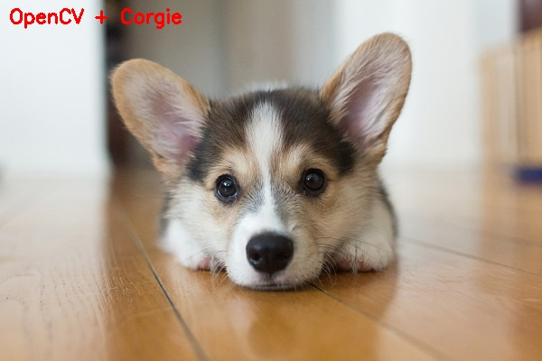

# Readme

### Oryginalny obraz

### ROI

### Zmiana rozmiaru

### Obrócony

### Obrócony i nie przycięty

### Rozmyty

### Prostokąt

### Okrąg

### Linia

### Tekst

## cv2
*_imread()_* - wczytuje obraz z pliku.

*_image.shape_* - pobiera właściwości kształtu obrazu (szerokość, wysokość, głębokość).

*_imshow()_* - wyświetla okno z obrazem.

*_waitKey()_* - czeka na wciśnięcie klawisza.

*_image[x, y]_* - pobiera wartości BGR danego piksela.

*_image[x1:x2, y1:y1]_* - pobiera wycinek obrazu o danych współrzędnych.

*_resize(image, (x, y))_* - zmienia wymiary obrazu na podane, ignorując proporcje obrazu.

*_getRotationMatrix(center, degree, scale)_* - tworzy macierz rotacji na podstawie środka obrazu, kąta obrotu i skali.

*_warpAffine(image, matrix, (width, height))_* - zwraca obrócony obraz na podstawie przekazanej macierzy obrotu.

*_GaussianBlur(image, kernel, sigma)_* - rozmywa obraz na podstawie przekazanych parametrów (im większy kernel tym bardziej rozmyty obraz).

*_rectangle(image, pt1, pt2, color, thickness)_* - rysuje na obrazie prostokąt, gdzie pt1 to lewy górny piksel, pt2 to prawy dolny piksel, color to wartość GBR koloru prostokąta i thickness to jego grubość w pikselach.

*_circle(image, center, radius, color, thickness)_* - rysuje na obrazie okrąg, gdzie center to piksel środkowy, radius to promień okręgu, color to wartość GBR koloru okręgu i thickness to jego grubość w pikselach (wartość ujemna zamalowuje cały okrąg na dany kolor).

*_line(image, pt1, pt2, color, thickness)_* - rysuje na obrazie linie, gdzie pt1 to piksel początkowy, pt2 to piksel końcowy, color to wartość GBR koloru linii i thickness to jej grubość w pikselach.

*_putText(image, text, start, font, scale, color, thickness)_* - rysuje na obrazie podany tekst, gdzie start to punkt początkoowy, font to wybrana przez nas czcionka, scale to skala tekstu, color to kolor tekstu, a thickness to jego grubość.

## imutils
*_resize(image, width, height)_* - zmienia wymiary obrazu, obliczając proporcje i dopasowując odpowiedni wymiar.

*_rotate(image, degree)_* - zwraca obrócony o daną ilość stopni obraz.

*_rotate_bound(image, degree)_* - zwraca obrócony o daną ilość stopni obraz, którego krawędzie nie są przycięte i są w całości widoczne.